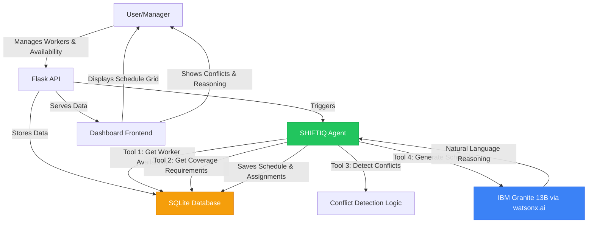

# SHIFTIQ - AI-Powered Shift Scheduling Assistant

**Built for IBM BOB Hackathon 2026**

SHIFTIQ is an AI-powered weekly shift scheduling assistant for small businesses with 5–20 workers. It eliminates the 1–2 hours managers waste every week manually building shift schedules, while preventing conflicts like double-bookings, understaffing, and over-scheduling.

## 🎯 Problem Statement

Small business managers spend 1–2 hours weekly on manual shift scheduling using WhatsApp or notebooks, frequently producing:
- Two people requesting the same day off
- Critical shifts left unstaffed
- Workers over-scheduled beyond their stated availability

## 💡 Solution

SHIFTIQ uses **IBM watsonx.ai** with the **IBM Granite 13B Instruct v2** model to:
1. Analyze worker availability and coverage requirements
2. Detect scheduling conflicts automatically
3. Generate optimized weekly schedules with natural-language reasoning
4. Provide actionable recommendations for future improvements

## 🏗️ Architecture



## 🚀 Quick Start

### Prerequisites
- Docker and Docker Compose
- IBM watsonx.ai API credentials

### Setup

1. **Clone the repository**
```bash
git clone <repository-url>
cd AI_TeamPlanning_Assist
```

2. **Configure environment variables**
```bash
cp .env.example .env
```

Edit `.env` and add your IBM watsonx credentials:
```env
IBMWATSONX_API_KEY=your_api_key_here
IBMWATSONX_PROJECT_ID=your_project_id_here
IBMWATSONX_URL=https://us-south.ml.cloud.ibm.com
```

3. **Start the application**
```bash
docker-compose up --build
```

4. **Access the dashboard**
Open your browser to: `http://localhost:5000`

## 🎮 Demo Scenario

The application comes pre-seeded with:
- **10 fictional workers** across 3 roles (Cashier, Supervisor, Technician)
- **Mixed availability patterns** creating realistic scheduling challenges
- **Coverage requirements** for 7 days × 2 shifts (Morning/Evening)
- **Pre-existing conflicts** that demonstrate the AI's conflict resolution

### Try This:
1. Open the dashboard → See understaffed Friday Evening cell in amber
2. Click **"Generate Schedule"** → Watch IBM Granite analyze and assign workers
3. Open **Conflicts tab** → Read Granite's natural-language reasoning
4. Click a worker card → Toggle their Saturday availability off
5. Click **Generate** again → See the schedule intelligently update

## 🧪 Testing

Run the test suite:
```bash
docker-compose exec shiftiq pytest tests/test_agent.py -v
```

Tests cover:
- ✅ Worker availability database reads
- ✅ Conflict detection (understaffed slots)
- ✅ Max hours constraint validation
- ✅ Flask API endpoints
- ✅ Schedule generation (with fallback)
- ✅ Schedule coverage completeness

## 🛠️ Technology Stack

- **Backend**: Python 3.11, Flask
- **AI/ML**: IBM watsonx.ai, IBM Granite 13B Instruct v2
- **Database**: SQLite
- **Frontend**: HTML5, CSS3, Vanilla JavaScript
- **Deployment**: Docker, Docker Compose
- **SDK**: ibm-watson-machine-learning

## 📁 Project Structure

```
.
├── agent/
│   └── shiftiq_agent.py       # IBM watsonx agent with 4 tools
├── database/
│   └── init_db.py             # Database schema and seed data
├── frontend/
│   └── index.html             # Single-page dashboard
├── tests/
│   └── test_agent.py          # Unit tests
├── app.py                     # Flask API server
├── requirements.txt           # Python dependencies
├── Dockerfile                 # Container definition
├── docker-compose.yml         # Service orchestration
└── .env.example               # Environment template
```

## 🔑 Key Features

### 1. Worker Management
- Add/edit workers with roles and max hours
- Visual 7-day availability grid
- Real-time availability tracking

### 2. AI-Powered Scheduling
- IBM Granite 13B analyzes constraints
- Detects conflicts before they happen
- Natural-language reasoning for every decision

### 3. Conflict Resolution
- **UNDERSTAFFED**: Identifies slots with insufficient coverage
- **DOUBLE_BOOKED**: Prevents overlapping assignments
- **UNAVAILABLE_ASSIGNED**: Respects worker availability

### 4. Visual Dashboard
- Color-coded shift grid (green=full, amber=partial, red=empty)
- Worker cards with availability indicators
- Conflict panel with AI reasoning

### 5. Graceful Fallback
- If watsonx API is unavailable, uses rule-based scheduling
- No crashes, always generates a schedule
- Clear indication of fallback mode

## 📊 IBM Technology Integration

SHIFTIQ leverages IBM watsonx.ai through:

1. **Model**: `ibm/granite-13b-instruct-v2`
2. **SDK**: `ibm-watson-machine-learning` Python package
3. **Prompt Engineering**: Structured prompts with worker availability matrix, coverage requirements, and detected conflicts
4. **Response Parsing**: Extracts assignments, conflict resolutions, quality ratings, and recommendations

### Granite 13B Capabilities Used:
- **Constraint reasoning**: Understands complex scheduling rules
- **Natural language generation**: Explains decisions in plain English
- **Structured output**: Produces parseable assignment lists
- **Recommendation generation**: Suggests operational improvements

## 🎯 Business Impact

- **Time Savings**: Reduces scheduling from 60+ minutes to under 2 minutes
- **Conflict Prevention**: AI detects issues before they affect operations
- **Transparency**: Natural-language reasoning builds manager trust
- **Scalability**: Handles 5–20 workers efficiently

## 📝 License

MIT License - Built for IBM BOB Hackathon 2026

## 👤 Author

**Leonhard Satria Suharjo**  
Data Analysis Undergraduate, University of Messina, Italy  
IBM BOB Hackathon 2026 Participant
